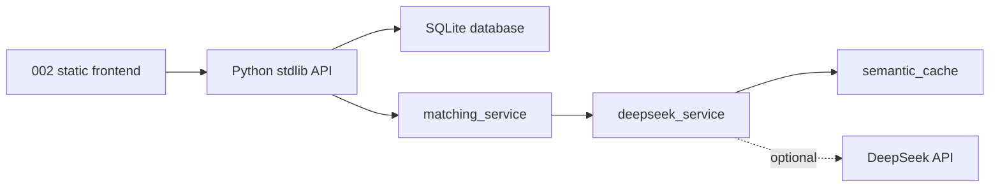

# HookAt Backend MVP

## Architecture



## Endpoints

- `GET /api/config`
- `POST /api/profiles`
- `GET /api/profiles/{profile_id}`
- `PATCH /api/profiles/{profile_id}`
- `DELETE /api/profiles/{profile_id}`
- `POST /api/profiles/{profile_id}/criteria`
- `GET /api/profiles/{profile_id}/criteria`
- `PATCH /api/profiles/{profile_id}/criteria`
- `POST /api/matches/search`

All API responses use:

```json
{"success": true, "data": {}, "error": null}
```

or:

```json
{"success": false, "data": null, "error": {"code": "validation_error", "message": "...", "details": {}}}
```

## Local Run

```bash
cp .env.example .env
python3 -m backend.server
```

Open `http://127.0.0.1:8000`.

## Database

The MVP uses SQLite through Python's standard library. Set `DATABASE_URL=sqlite:///./backend/hookat.db`.
The schema is in `backend/schema.sql`; the server initializes tables and demo match candidates on startup.

## DeepSeek

Set these variables only on the server:

```env
DEEPSEEK_API_KEY=
DEEPSEEK_BASE_URL=https://api.deepseek.com
DEEPSEEK_MODEL=deepseek-chat
```

The frontend never receives the key. DeepSeek receives minimized matching data without names, email, phone, password, or precise address. If DeepSeek is unavailable, matching falls back to structured scoring.

## Deployment

For a simple VPS or local server, run `python3 -m backend.server` behind HTTPS and a process manager.
For production, replace SQLite with managed PostgreSQL/Supabase and move the same schema to migrations with RLS or equivalent row ownership checks.
